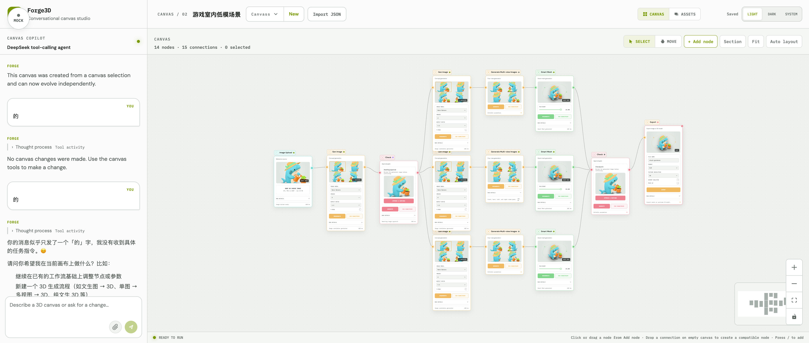

# Forge3D Canvas Studio

[Live Demo](https://forge3d.lumixraku.org/)

> This is the detailed project reference. Start with the [root README](../README.md).
> The HTTP contract is documented separately in [API Reference](api.md). See
> [Progress](progress.md) for the repository work log and [Todo](todo.md) for
> pending work.

Forge3D is a local-first, conversational canvas studio for designing reusable 3D production pipelines. A DeepSeek-powered Agent translates natural-language requests into a versioned JSON directed acyclic graph (DAG), while Vue Flow renders that domain model as an editable infinite canvas.

The repository is both a working demo and a reference implementation. This document describes the product, interaction model, data contracts, rendering rules, Agent protocol, persistence, local runtime, Cloudflare deployment, and known limitations in enough detail for another engineer or AI coding agent to reproduce the project.

Chat requires a DeepSeek API key. Canvas execution is intentionally simulated: no external image-generation, mesh-generation, retopology, rigging, texture, or export service is called.



## Product Goals

Forge3D combines two editing modes over the same authoritative canvas document:

1. **Conversational editing**: the Canvas Copilot inspects, builds, and updates the graph through validated tools.
2. **Direct manipulation**: the user adds, connects, moves, groups, configures, copies, runs, imports, and exports nodes on the canvas.

The important architectural boundary is that Vue Flow is a renderer and interaction surface, not the persisted data model. The server owns a framework-neutral canvas JSON document containing domain nodes, semantic edges, viewport state, revision metadata, Session history, Agent turns, and execution runs.

## Current Product Surface

The page has two mutually exclusive workspace modes:

- **Canvas workspace**: top bar, Canvas Copilot on the left, and an infinite node canvas on the right.
- **Model Editor workspace**: a focused 3D result viewer opened from successful model-producing nodes.

### Top Bar

The top bar contains:

- Forge3D brand and product subtitle.
- Current canvas name and zero-padded revision.
- Canvas switcher.
- New canvas action.
- Save state: `Unsaved changes`, `Saving…`, `Saved`, or `Save failed`.
- Light/dark theme switcher.

Double-click the current canvas name to rename it. `Enter` saves, `Escape` cancels, and blur commits a non-empty changed value.

### Canvas Copilot

The left panel is a Tiptap-powered chat composer and Session history:

- User messages are labeled `YOU`; assistant messages are labeled `FORGE`.
- `Cmd+Enter` on macOS or `Ctrl+Enter` elsewhere sends a message.
- Enter inserts a normal line break.
- Multiple attachments can be inserted into the composer.
- Image attachments receive local object-URL previews.
- Attachments are currently serialized to text as `[Attachment: filename]`; binary files are not uploaded to the server.
- Assistant Markdown uses GFM and line breaks via `marked`, then passes through DOMPurify with raw HTML disabled.
- Safe progress labels are streamed while the Agent runs.
- Raw model reasoning, raw tool arguments, and raw tool outputs are not exposed.
- Completed tool activity can be collapsed under the assistant response.
- The Agent can pause and render a generic single- or multi-select question card.

### Infinite Canvas

The canvas is implemented with Vue Flow and includes:

- Free node positioning.
- Directed connections.
- Partial-intersection box selection.
- Shift multi-selection.
- Frame grouping and nesting.
- Copy, paste, duplicate, and delete.
- Drag-to-create nodes from the Add node menu.
- Drag a connection onto empty canvas to open a compatible-node menu.
- A per-node `+` action that creates and connects a downstream node.
- ELK automatic layout.
- Fit-to-view.
- Background grid.
- Pannable and zoomable MiniMap.
- Vue Flow controls.
- Persisted viewport.

The precise Vue Flow configuration is:

| Setting | Value |
| --- | --- |
| Minimum zoom | `0.08` |
| Maximum zoom | `3.5` |
| Grid snapping | Disabled |
| Pan on scroll | Enabled |
| Zoom on scroll | Disabled |
| Selection mode | Partial intersection |
| Multi-select key | `Shift` |
| Background gap | `24` |
| Background dot size | `1.2` |
| MiniMap position | Bottom right |
| MiniMap size | `160 x 100` |
| MiniMap pan/zoom | Enabled |

Drag-to-pan is enabled for coarse pointer devices. Application code handles deletion instead of Vue Flow's built-in delete key behavior.

### Canvas Toolbar

The toolbar provides:

- `+ Add node`: open the categorized node catalog.
- `Frame`: create a frame immediately.
- `Gen HD Model`: create a `generate-model` node immediately.
- `Fit`: fit all nodes with `0.18` padding and a 400 ms transition.
- `Auto layout`: run ELK layout and persist the result.
- `Run canvas` / `Run again`: start simulated execution.

Auto layout is disabled while the Agent or save operation is busy and when the graph is empty. Canvas execution is disabled while another run or blocking operation is active.

## Canvas Management

The canvas switcher shows each canvas name, node count, and revision. It supports:

- Open canvas.
- Create canvas.
- Import JSON by picker or drag-and-drop.
- Export JSON.
- Duplicate.
- Delete with confirmation.

Creating a canvas asks for a name with `window.prompt` and defaults to:

```json
{
  "name": "New 3D canvas",
  "description": "A new 3D production canvas ready to customize.",
  "nodes": [],
  "edges": [],
  "viewport": { "x": 80, "y": 160, "zoom": 0.72 }
}
```

Import removes external `id`, `revision`, `createdAt`, and `updatedAt` fields, then creates a new canvas rather than overwriting the current one. Export downloads pretty-printed JSON as `<canvas-name>.canvas.json`.

Duplication deep-copies nodes, edges, and viewport, resets the revision to 1, names the copy `<original> Copy`, and creates a separate Session.

### Autosave

Canvas edits are throttled to at most one save every 2000 ms: the first edit of a
burst is sent one interval later, and continuous editing keeps saving at that rate
rather than waiting for the user to stop. Saves are serialized:

1. The current domain snapshot is placed in a pending slot.
2. Only one `PUT` request runs at a time.
3. If edits occur during the request, the newest pending snapshot is saved afterward.
4. Older network responses cannot overwrite newer local state.

Some edits do not wait out that interval and are saved immediately: adding or
removing a node, an asset upload completing, focus entering the Agent panel,
sending an Agent message, starting a run, switching or deleting a canvas, page
blur/hide, and the idle release of the edit lease. Everything else — dragging
nodes, editing parameters, connecting edges, resizing sections, undo/redo, auto
layout — goes through the throttle.

## Node Catalog

The Add node menu has a fixed category order:

```text
Annotate → Input → 2D → 3D → Output → Video
```

Empty categories are not rendered. `Video` is reserved and currently has no nodes.

Hidden nodes remain valid definitions so older persisted canvases can still load, but they are excluded from both the full Add node menu and connection-derived compatible-node menus.

| Category | Type | Label | Inputs | Output | Menu |
| --- | --- | --- | --- | --- | --- |
| Annotate | `frame` | Frame | None | None | Visible |
| Annotate | `review` | Check | Image | Image | Visible |
| Input | `reference-image` | Image Upload | None | Image | Visible |
| Input | `prompt` | Text Prompt | None | Text | Visible |
| 2D | `generate-image` | Gen Image | Image, text | Image | Visible |
| 2D | `generate-multiview-images` | Generate Multi-view Images | Image, text | Image views | Visible |
| 3D | `generate-model` | Gen HD Model | Image, text | Model | Visible |
| 3D | `smart-mesh` | Smart Mesh | Image, text | Model | Visible |
| 3D | `multiview-to-3d` | Multi-view to 3D | Front, back, left, right images | Model | Visible |
| 3D | `text-to-3d` | Text to 3D | Text | Model | Hidden legacy type |
| 3D | `retopology` | Retopology | Model | Model | Visible |
| 3D | `texture` | UV Texture | Model, image, text | Model | Visible |
| 3D | `rigging` | Rigging | Model | Model | Visible |
| 3D | `segments` | Segments | Model | Model | Visible |
| 3D | `model-preview` | Model preview | Model | Model | Visible |
| Output | `generated-image` | Image | Image | Image | Hidden compatibility type |
| Output | `export-model` | Export | Image, model | None | Visible |

`Export` belongs to the `Output` category. The generic generated `Image` node is intentionally hidden from Add node while remaining loadable.

### Runtime Port Model

A node declares its ports as two keyed maps, `inputs` and `outputs`, of port id to
`{ type, label?, multiple?, fallbackConfig? }`. The key *is* the port
id, so a declaration cannot drift from the ids stored edges reference.

Ports describe data flow only. What a node cannot run without is a separate
declaration, `requires`, listing parameter keys rather than ports — see
`docs/execution-engine.md` §6.

Data follows those declarations; the canvas deliberately does not render them:

- Every node with at least one input receives exactly one handle: `{ id: "input" }`. Every producing node receives exactly one: `{ id: "output" }`.
- Multi-view and Texture therefore render a single universal handle pair rather than every declared port.
- Input and output values may be arrays. Array length and item types are data concerns and must never create additional handles.
- Do not add typed, indexed, or per-item handles. An output may retain result metadata for UI/runtime inspection, but it never affects handle count or connection validation.
- Multiple upstream edges may target the same universal input handle.
- Connection validation does enforce port type compatibility, alongside handle existence, missing nodes, self-connections, and duplicate edges.

One visual edge stands for one or more logical edges. Ports pair by matching key
first, then by compatible type, so `generate-multiview-images` and
`multiview-to-3d` sharing the keys `front`/`back`/`left`/`right` makes a single
connection between them resolve per view. A port declared `multiple` collects
every compatible output of a collapsed edge, which is how one connection from a
four-view node feeds all four images into `generate-model`.

Persisted legacy handle names `input` and `output` resolve to the first output and
the first type-compatible input. Multiple legacy edges between the same source and
target may collapse to one edge.

Execution resolves inputs through these declarations rather than by inspecting
upstream node types: `resolveNodeInputs` returns a map of input port id to value,
`resolveInputSources` reports which upstream node and port feeds each input, and a
node whose port declares `fallbackConfig` reads that config field when nothing is
connected. A run's own results take precedence over the values the canvas saved,
which is what lets a single-node run read upstream output it did not produce.

One documented exception remains: `texture` searches upstream for a reference
image beyond its declared ports, because `/models/texture` fails with
`reference_image_path not found` unless it is sent the original reference, which
by then sits several hops back with no edge to the texture node.

This distinction is important when reproducing the current UI: implement the conceptual catalog and the universal rendered handle model separately.

## Node UI And Parameters

Normal nodes share a common card structure:

- Input handle.
- Node kind and runtime status.
- Editable title.
- Result preview or execution state.
- Type-specific controls.
- Generate/regenerate action.
- Run downstream action.
- Optional Open in Model Editor action.
- Run duration/error details.
- Output handle and downstream `+` action.

Double-click a node title to rename it. Node run status takes precedence over static node state and supports `ready`, `queued`, `running`, `succeeded`, `failed`, and `waiting_review`.

### Default Configuration Catalog

#### `reference-image`

```json
{
  "sourceType": "Upload",
  "reference": "",
  "background": "Keep",
  "preview": "/shark-reference.png"
}
```

- Source: `Upload`, `Asset Library`, `URL`.
- Background: `Keep`, `Remove`.
- Image Upload supports clicking or dropping a JPG, PNG, or WEBP file up to 20 MB.
- Upload is currently mocked in the browser with a data URL; no OSS or remote object storage is connected.

#### `prompt`

```json
{
  "prompt": "Production-ready stylized 3D asset",
  "strength": 80
}
```

- Strength range: `0-100`, step `1`, displayed as `%`.

#### `generate-image`

```json
{
  "model": "GPT Image 2",
  "count": 4,
  "aspectRatio": "1:1",
  "referenceMode": "Image + Prompt",
  "previews": [
    "/shark-concept-front.png",
    "/shark-concept-left.png",
    "/shark-concept-right.png",
    "/shark-concept-back.png"
  ]
}
```

- Model: `GPT Image 2`, `Flux 1.1 Pro`, `Stable Diffusion 3.5`.
- Count: `1`, `2`, `4`.
- Aspect ratio: `1:1`, `4:3`, `3:4`, `16:9`.
- Reference mode: `Image + Prompt`, `Prompt only`, `Image variation`.
- Results render as selectable candidates; clicking one selects and opens it.

#### `generate-multiview-images`

```json
{
  "model": "GPT Image 2",
  "aspectRatio": "1:1",
  "referenceMode": "Image + Prompt",
  "viewPreviews": {
    "front": "/shark-concept-front.png",
    "back": "/shark-concept-back.png",
    "left": "/shark-concept-left.png",
    "right": "/shark-concept-right.png"
  }
}
```

Uses the same model, aspect ratio, and reference mode choices as Gen Image. Results are shown in front/back/left/right order.

#### `review`

```json
{
  "instruction": "Review the generated image before continuing.",
  "preview": "/shark-concept-front.png",
  "approved": false
}
```

The preview prefers an upstream image, then the latest run output, then local config. Toggling from unapproved to approved automatically runs downstream nodes.

#### `generate-model`, `multiview-to-3d`, and legacy `text-to-3d`

```json
{
  "modelVersion": "Smart Mesh",
  "textureMode": "PBR",
  "faceType": "Triangle",
  "faceCount": 20000,
  "preview": "/shark-model.png"
}
```

- Model version: `Smart Mesh`, `v2.5`, `v2.0`.
- Texture: `None`, `HD`, `PBR`.
- Face type: `Triangle`, `Quad`.
- Face count: `1000-50000`, step `1000`.

Legacy `quality` and boolean `texture` fields are normalized. Legacy `text-to-3d` nodes are migrated to `generate-model` when loaded.

#### `smart-mesh`

```json
{
  "faceType": "Triangle",
  "faceCount": 20000,
  "textureQuality": "No texture",
  "pbr": true,
  "preview": "/shark-model.png"
}
```

- Face type: `Triangle`, `Quad`.
- Face count: `1000-50000`, step `1000`.
- Texture quality: `No texture`, `2K`, `4K`, `8K`.
- Generate PBR maps: boolean.

#### `retopology`

```json
{
  "modelVersion": "v2.0",
  "faceType": "Triangle",
  "faceLimit": 10000,
  "bakeTextures": true,
  "preview": "/shark-retopology.png"
}
```

- Model version: `v2.0`, `v1.0`.
- Face type: `Triangle`, `Quad`.
- Face limit: `500-20000`, step `500`.
- Bake textures: boolean.
- Legacy `targetFaces` maps to `faceLimit`.

#### `texture`

```json
{
  "textureQuality": "2K",
  "pbr": true,
  "preview": "/shark-textured.png"
}
```

- Texture quality: `2K`, `4K`, `8K`.
- Generate PBR maps: boolean.
- Legacy `resolution`, `model`, and `style` fields are normalized or removed.

#### `rigging`

```json
{
  "preview": "/shark-model.png"
}
```

No editable parameters in the node card. The Model Editor uses a rig visualization mode.

#### `segments`

```json
{
  "detailLevel": "low",
  "preview": "/shark-model.png"
}
```

- Detail level: `low`, `medium`, `high`.
- The Model Editor uses an exploded segmented-model mode.

#### `model-preview`

```json
{
  "environment": "Studio",
  "autoRotate": true,
  "wireframe": false,
  "preview": "/shark-review.png"
}
```

- Environment: `Studio`, `Outdoor`, `Neutral`.
- Auto rotate: boolean.
- Wireframe: boolean.
- Legacy `viewer: "turntable"` enables auto-rotate; legacy background config is removed.

#### `export-model`

```json
{
  "modelFormat": "GLB",
  "exportTargets": ["dcc"],
  "preview": "/shark-model.png"
}
```

- Model format: `GLB`, `OBJ`, `FBX`, `STL`.
- Export targets are an array of enabled outputs rendered as checkboxes.
- This is a terminal node and has no output handle.

#### `frame`

New toolbar frames default to:

```json
{
  "name": "New canvas frame",
  "width": 900,
  "height": 600,
  "description": ""
}
```

Frames created around a selection use `Canvas frame` as the default name.

## Frame Semantics

Frames are Vue Flow parent nodes and visual containers, not DAG stages:

- They have no input or output handles.
- Child node positions are persisted relative to the frame.
- Child nodes use parent extent and expand the parent while dragged.
- Moving a frame moves descendants through Vue Flow parent semantics.
- Resizing is enabled with a minimum size of `260 x 180`.
- Frame z-index is lower than ordinary nodes.
- Frames can contain nested frames.
- `Make as a frame` wraps selected top-level nodes while preserving absolute positions.
- `Dissolve frame` reparents children to the dissolved frame's parent or canvas while preserving absolute positions.
- `Create canvas` exports selected content as a reusable fragment, normalizing positions relative to the selection bounds.

When grouping, the frame bounds are derived from selected nodes plus visual padding. When ungrouping, descendants are processed carefully so nested coordinate systems are preserved.

## Selection, Clipboard, And Keyboard

The app-level clipboard stores a normalized snapshot of selected nodes and internal edges. Paste:

- Generates new IDs.
- Offsets nodes from the source position or targets the canvas context-menu position.
- Reconstructs parent/child relationships.
- Rewrites edges to the new node IDs.
- Selects the pasted nodes.
- Persists the result.

Copy/paste works between canvases during the same browser session.

Supported shortcuts include:

| Shortcut | Action |
| --- | --- |
| `/` | Open Add node at the viewport center |
| `Cmd/Ctrl+A` | Select all nodes |
| `Cmd/Ctrl+C` | Copy selected nodes |
| `Cmd/Ctrl+V` | Paste |
| `Cmd/Ctrl+D` | Duplicate selected nodes |
| `Delete` / `Backspace` | Delete selected nodes or selected edges |
| `Escape` | Close menus and previews or cancel current UI state |

Shortcuts are ignored while typing into inputs, textareas, selects, buttons, or contenteditable regions.

## Automatic Layout

`src/canvas-layout.js` uses ELK's layered algorithm.

The layout preserves frame hierarchy by building a compound graph:

- Root nodes become root ELK children.
- Frame children become nested ELK children.
- DAG edges are translated to ELK edges.
- Result coordinates are written back relative to each parent.
- Frame dimensions are updated from the ELK result.
- Layout changes are persisted.

When an Agent emits `canvas-updated` with `structure_changed: true`, the frontend refreshes the authoritative canvas, automatically lays it out, and saves the resulting positions.

## Canvas Execution

Agent tools modify the canvas definition; execution is a separate system with
three interchangeable backends.

| Provider | When it runs | Behaviour |
| --- | --- | --- |
| `mock` | Always available | Simulated. ~600 ms per node, deterministic previews from `public/`, no credits. |
| `tripo` | `TRIPO_API_KEY` is set | Real Tripo v3 tasks. Tens of seconds per node, real geometry, spends credits. |
| `meshy` | `MESHY_API_KEY` is set | Real Meshy tasks. Image/text/multi-view to 3D, spends credits. |

A run picks `tripo` whenever it is configured, then `meshy`. The floating debug
panel (bottom right) overrides that per run, and `POST /api/nodes/:nodeId/executions`
accepts an explicit `"provider": "mock" | "tripo" | "meshy"`. `GET /api/capabilities`
reports which providers this server can serve.

Six node types are backed by Tripo; everything else stays simulated even when the
provider is `tripo`:

| Node | Tripo endpoint |
| --- | --- |
| `generate-model` | `POST /generation/image-to-model`, or `/text-to-model` with no image upstream |
| `retopology` | `POST /mesh/decimate` (`smartPoly` selects the `v2.0` AI tier) |
| `texture` | `POST /models/texture` |
| `segments` | `POST /mesh/segment` |
| `rigging` | `POST /animations/rig` |
| `export-model` | `POST /models/convert` |

Meshy backs `generate-model` only; under `meshy` every other node type falls
through to the simulation:

| Node | Meshy endpoint |
| --- | --- |
| `generate-model` | `POST /openapi/v1/image-to-3d`, `/openapi/v1/multi-image-to-3d` (several views), or `/openapi/v2/text-to-3d` with no image upstream (two-step: `preview`, then `refine` when texture is on) |

The 2D image nodes are not mapped yet because Tripo's image models are a separate
enum (`seedream`, `banana`, `chat_image`).

Tripo output URLs expire about five minutes after a task succeeds, so each result
is copied to `server/data/assets/` as soon as the task completes and the canvas
stores that local path. Files are named by content hash and served from
`GET /api/assets/:file`, which only resolves hashed names.

Because a real result only exists once its task finishes, a run threads a
per-node context and passes each upstream `task_id` straight into the next node's
`input`, so no mesh is re-uploaded between stages. Input resolution reads the full
canvas rather than the pruned execution subgraph: a single-node run carries no
edges, so the upstream image would otherwise be invisible.

### Simulated Execution

The `mock` provider is the original simulated system.

The UI can run:

- A single node: `scope: "node"` with `targetNodeId`.
- A target node and every reachable downstream node: `scope: "downstream"`.
- The whole canvas: `scope: "node"` without a target, despite the historical scope name.

The server:

1. Creates a run tied to the current canvas revision.
2. Selects the requested subgraph.
3. Traverses it topologically.
4. Marks nodes queued/running/succeeded/failed.
5. Waits roughly 600 ms per node.
6. Produces deterministic preview/output metadata.
7. Persists each transition.

Set `node.config.mockFailure` to exercise failure UI. Failed nodes stop downstream progress. The frontend polls the run endpoint until a terminal state and merges per-node status into the canvas.

The latest persisted run state is restored when a canvas opens, but only when the run revision matches the current canvas revision and the referenced node still exists.

## Model Editor

Successful model-producing nodes expose `Open in Model Editor`. The editor is a separate workspace with:

- Return-to-canvas navigation.
- Scene controls and model display.
- Standard model mode.
- Rigging overlay mode for rigging results.
- Exploded segmented-model mode for split results.
- Sample GLB assets from `public/models/`.

The current editor is a visualization demo, not a persistent mesh-editing backend. Returning to the canvas triggers a canvas fit.

## Domain Data Model

### Canvas

```json
{
  "schemaVersion": "1.0",
  "id": "canvas-example",
  "name": "Stylized Character Pipeline",
  "description": "Generate and prepare a production model.",
  "revision": 3,
  "createdAt": "2026-07-27T10:00:00.000Z",
  "updatedAt": "2026-07-27T10:05:00.000Z",
  "nodes": [],
  "edges": [],
  "viewport": { "x": 80, "y": 160, "zoom": 0.72 }
}
```

### Node

```json
{
  "id": "retopology",
  "type": "retopology",
  "name": "Retopology",
  "config": {
    "faceLimit": 10000,
    "faceType": "Triangle",
    "bakeTextures": true
  },
  "ui": {
    "position": { "x": 420, "y": 140 },
    "parentId": "frame-main",
    "width": 320,
    "height": 520
  }
}
```

`config` is domain-specific. `ui` contains renderer-independent position, optional frame parent, and optional dimensions.

### Edge

```json
{
  "id": "edge-model-retopology",
  "source": { "nodeId": "generate-model", "port": "output" },
  "target": { "nodeId": "retopology", "port": "input" }
}
```

The persisted edge shape remains semantic and does not persist Vue Flow's complete internal edge object.

### Session

```json
{
  "id": "session-example",
  "canvasId": "canvas-example",
  "createdAt": "2026-07-27T10:00:00.000Z",
  "updatedAt": "2026-07-27T10:05:00.000Z",
  "messages": [
    {
      "id": "msg-example",
      "role": "assistant",
      "content": "Describe the canvas you want to build.",
      "createdAt": "2026-07-27T10:00:00.000Z"
    }
  ]
}
```

### Agent Turn

Turns persist queued, active, waiting, successful, and failed Agent turns. Important fields include:

```json
{
  "id": "turn-example",
  "sessionId": "session-example",
  "canvasId": "canvas-example",
  "message": "Add retopology and export",
  "status": "waiting_for_user",
  "progress": [],
  "request": {
    "request_id": "request-example",
    "prompt": "Choose an export format",
    "options": [
      { "id": "glb", "label": "GLB" },
      { "id": "fbx", "label": "FBX" }
    ],
    "min": 1,
    "max": 1
  },
  "createdAt": "2026-07-27T10:00:00.000Z",
  "updatedAt": "2026-07-27T10:00:03.000Z"
}
```

### Run

```json
{
  "id": "run-example",
  "canvasId": "canvas-example",
  "canvasRevision": 3,
  "status": "running",
  "createdAt": "2026-07-27T10:00:00.000Z",
  "completedAt": null,
  "nodeRuns": {
    "retopology": {
      "status": "running",
      "durationMs": null,
      "output": null,
      "error": null
    }
  }
}
```

## Agent Architecture

There are two Agent execution paths.

### Pi Agent Service Path

This is the default local development topology:

```text
Vue app :5175
  → Vite /api proxy
Node API :8787
  → NDJSON over HTTP
Pi Agent Service :8788
  → OpenAI-compatible chat completions
DeepSeek API
```

The Agent Service is a separate Node process because the Pi packages use Node built-ins that are unavailable in a standard Cloudflare Workers runtime.

### Direct DeepSeek Path

Set:

```bash
AGENT_SERVICE_URL=direct
```

The Node API then runs the custom DeepSeek tool-call loop in-process. Cloudflare Worker deployments also use this path when `AGENT_SERVICE_URL` is not configured.

The two paths are intentionally similar but not identical:

- Direct DeepSeek uses up to the latest 20 Session messages.
- The current Pi Agent Service request does not forward Session history; it receives the current request and canvas.
- Direct mode defaults to `deepseek-v4-flash` when no model is supplied by its caller.
- Agent Service mode defaults to `deepseek-chat`.
- Pi progress labels are prefixed with `Pi ·`.
- Local Pi runs support in-memory steering by canvas.

## Agent Tools

The Agent has seven validated tools. Tool calls are server-side only; the browser receives safe progress summaries and an authoritative canvas invalidation event.

| Tool | Purpose |
| --- | --- |
| `get_canvas_structure` | Inspect every node and edge on the current canvas. |
| `list_available_node_types` | List node types that can be created. |
| `build_canvas` | Append a canvas section from an ordered node type list, with a generated frame, placement, and compatible edges. |
| `get_canvas_parameters` | Inspect adjustable parameters for nodes currently in the canvas. |
| `update_node_parameters` | Validate and update canonical parameters on one exact node ID. |
| `add_canvas_node` | Add one supported node or a separate frame. |
| `request_user_select` | Pause the turn and request a finite user choice. |

### Available Agent Node Types

```text
reference-image
prompt
generate-image
generate-multiview-images
generate-model
smart-mesh
multiview-to-3d
review
text-to-3d
retopology
texture
rigging
split
model-preview
export-model
```

`frame` can be added separately but is not supplied as a `build_canvas` node type. Duplicate node types in a build request are de-duplicated.

### `get_canvas_structure`

Input:

```json
{}
```

Returns every `{ id, type, name }` node and edge on the current canvas, across all canvas sections. Extra properties are rejected.

### `list_available_node_types`

Input:

```json
{}
```

Returns all node types that can be created.

### `build_canvas`

Input:

```json
{
  "nodeTypes": [
    "reference-image",
    "generate-multiview-images",
    "multiview-to-3d",
    "export-model"
  ]
}
```

The list must be non-empty and contain supported non-frame node types. The planner creates a frame, creates default-configured nodes, places them, connects adjacent compatible nodes, increments the canvas revision, and returns the new frame ID, node summaries, and edges.

### `get_canvas_parameters`

Input:

```json
{}
```

Returns current node summaries and a human-readable parameter description. It describes only nodes currently present, not the complete catalog.

### `update_node_parameters`

Input:

```json
{
  "nodeId": "generate-model",
  "parameters": {
    "faceCount": 12000,
    "textureMode": "PBR"
  }
}
```

Rules:

- `nodeId` must be the exact existing ID, not a display label or type.
- Unknown fields are rejected.
- Number ranges and step sizes are validated.
- Boolean and string types are validated.
- Enum matching is case-insensitive and normalized to canonical values.
- Array values are restricted to allowed values and de-duplicated.
- Unchanged values do not create change records.
- Group changes for one node into one call; use separate calls for different nodes.

### `add_canvas_node`

Input:

```json
{
  "type": "retopology"
}
```

Normal node types are not duplicated. A new node is inserted before `export-model` or `model-preview` where applicable, edges are rebuilt, and frame bounds are updated. `review` is inserted before the model-generation node. Frames can be added repeatedly as independent containers.

### `request_user_select`

Input:

```json
{
  "prompt": "Choose a model version",
  "options": [
    { "id": "v2", "label": "v2.0" },
    { "id": "v25", "label": "v2.5" }
  ],
  "min": 1,
  "max": 1
}
```

Option IDs must be unique, the option list must be non-empty, and `1 <= min <= max <= options.length`. The turn becomes `waiting_for_user`, persists the request, emits the selection event, and stops without a `finish`.

## Agent SSE Protocol

One long-lived SSE channel per canvas carries every server-pushed event for it. The browser opens it with `EventSource` when it opens the canvas, and closes it when it opens another or unmounts:

```http
GET /api/canvases/canvas-example/events
Accept: text/event-stream
```

Response headers:

```http
Content-Type: text/event-stream; charset=utf-8
Cache-Control: no-cache
Connection: keep-alive
```

Starting a turn is a separate plain request that returns `202` with the turn; its events arrive on the channel:

```http
POST /api/sessions/session-example/turns
Content-Type: application/json

{
  "message": "Add retopology and export"
}
```

Every SSE frame has a transport event name, a JSON business payload, and a transport ID:

```text
event: message
data: {"type":"progress","canvas_id":"canvas-example","session_id":"session-example","turn_id":"turn-example","step_id":"progress-1","label":"Building canvas","status":"running"}
id: 2-0

```

- Normal business events use `event: message`.
- Failures use `event: error`.
- The business event type is always `data.type`.
- Every payload contains `canvas_id`, `session_id` and `turn_id`. A client filters by `session_id` and matches a chat bubble by `turn_id`.
- SSE `id:` is `<seq>-0`, where `seq` counts events per canvas. It is not the same as a chat message's JSON `id`.
- Comment lines (`: subscribed` on open, `: keepalive` every 15s) carry no event and are ignored.
- Final assistant text is sent as one complete event, not token deltas.
- Nothing is buffered or replayed: `Last-Event-ID` has no effect. A client that reconnects re-reads state with `GET /api/canvases/:id`, `GET /api/canvases/:id/sessions`, `GET /api/sessions/:sessionId/chat-history`, and `GET /api/sessions/:sessionId/turns`, which is what opening a canvas already does.
- Because the channel belongs to the canvas and not to one request, a second client watching the same canvas sees the same events.

### Business Events

Only two user actions produce events: sending a message (`POST /api/sessions/:id/turns`)
and submitting a choice the Agent asked for (`POST /api/turns/:id/continue`). Both return
`202`; everything after that arrives on the channel.

| `data.type` | User action behind it | What the server just did | Frontend behavior | Important fields |
| --- | --- | --- | --- | --- |
| `turn-start` | The user pressed Enter to send a message, or submitted a choice for a paused turn. | Accepted the turn and moved it from `queued` to `running`. | Bind the server turn ID to the optimistic assistant message. A turn that asked a question emits this twice — once per user action — with the same `turn_id`. | — |
| `progress` | Same action; the user does nothing more. These frames are the Agent working. | Reported one step (reading canvas structure, building the node chain, inspecting or updating parameters). | Append safe visible Agent activity. | `step_id`, `label`, `status` |
| `request_user_select` | The user's message was underspecified, so the Agent asks back. | Persisted the options and parked the turn in `waiting_for_user` without a `finish`. | Stop pending state and render a choice card; submitting it resumes the turn with a new `turn-start`. | `request` |
| `text` | Nothing — this is the Agent answering the user's message. | Wrote the reply into the Session, then emitted this. | Replace pending text with the complete assistant reply. | `step_id`, `id`, `text` |
| `canvas-updated` | The user's message asked for canvas changes and the Agent made them. | Persisted the new canvas, then emitted this. | Fetch authoritative canvas state; auto-layout if structure changed. | `changed_node_ids`, `structure_changed` |
| `finish` | Nothing. | Closed the turn successfully; last frame for that `turn_id`. | End pending state. | `finish_reason: "stop"` |
| `error` | Nothing — any step above can fail into this. | Marked the turn `failed` and emitted the one `event: error` frame. | Mark the turn failed and show the message; the user can send again. | `error` |

Successful sequence:

```text
turn-start
progress × N
text
canvas-updated
finish
```

Selection sequence, which pauses the turn without ending the channel:

```text
turn-start
progress × N
request_user_select
```

Failure sequence:

```text
turn-start
progress × N
error
```

The canvas itself is never embedded in `canvas-updated`. The event is an invalidation signal; the frontend calls `GET /api/canvases/:id` and replaces local state with the persisted document.

### Continuing A Selection

```http
POST /api/turns/:turnId/continue
Content-Type: application/json

{
  "request_id": "request-example",
  "selected_option_ids": ["glb"]
}
```

The server validates turn state, request ID, unique options, allowed option IDs, and min/max selection count. It persists the answer, adds a user Session message containing selected labels, returns the turn to `queued`, and starts a fresh Agent call using the original request plus the selection. Like starting a turn, this returns `202`; the resumed turn's events continue on the canvas channel.

Submitting the exact same request ID and ordered selection again is idempotent. A conflicting second answer returns `409`.

## Pi Agent Service NDJSON Protocol

The API server calls the separate Agent Service with:

```http
POST http://127.0.0.1:8788/agent
Content-Type: application/json
```

```json
{
  "apiKey": "...",
  "baseUrl": "https://api.deepseek.com",
  "model": "deepseek-chat",
  "message": "Build a 3D canvas",
  "canvas": {}
}
```

The response is newline-delimited JSON with content type `application/x-ndjson`:

```json
{"type":"progress","event":{"label":"Pi · Reviewing your request","status":"running"}}
{"type":"result","plan":{"canvas":{},"reply":"Canvas updated.","changedNodeIds":[],"structureChanged":false}}
```

Message types are:

- `progress`: visible activity event.
- `result`: final Agent plan or selection request.
- `steered`: the message was added to an already active run.
- `error`: service-level failure encoded in the NDJSON body.

The service also exposes:

```http
GET /health
```

```json
{ "ok": true }
```

The `/agent` endpoint currently has no authentication and receives the DeepSeek key in its body. Keep it on a trusted local/private network or add authentication before exposing it publicly.

## HTTP API

### Projects And Canvases

| Method | Path | Purpose |
| --- | --- | --- |
| `GET` | `/api/projects` | List project summaries with `nodeCount` and `edgeCount`. |
| `POST` | `/api/projects` | Create a project, its one canvas, and one initial Session. |
| `GET` | `/api/projects/:id` | Return project metadata and canvas counts. |
| `PATCH` | `/api/projects/:id` | Update project metadata. |
| `DELETE` | `/api/projects/:id` | Delete the project and all associated canvas state. |
| `POST` | `/api/projects/:id/duplicate` | Deep-copy the project and its canvas into revision 1. |
| `GET` | `/api/canvases/:id` | Return the canvas and its latest compatible node-run state. |
| `PUT` | `/api/canvases/:id` | Replace canvas graph data and update `updatedAt`. |

Each project owns exactly one canvas and uses the same public ID as that canvas. Creation requires a non-empty name, unique node IDs, finite node positions, valid edge objects, and edges whose endpoint nodes exist inside the canvas. The server creates `schemaVersion`, ID, timestamps, revision, a default viewport if absent, and one persistent Agent Session.

`PUT` is a whole-document replacement rather than a validated PATCH. The path ID, project-owned `name`, `description`, and `createdAt`, and a new `updatedAt` are forced by the server; most graph fields are trusted. Clients should send the complete valid canvas document and use `PATCH /api/projects/:id` for project metadata.

### Executions

| Method | Path | Purpose |
| --- | --- | --- |
| `POST` | `/api/nodes/:nodeId/executions` | Create an execution from a globally unique entry node. |
| `GET` | `/api/executions/:executionId` | Return one execution with its per-node status and output. |
| `GET` | `/api/capabilities` | Report which execution providers this server can serve. |
| `GET` | `/api/assets/:file` | Serve a result copied off Tripo before its URL expired. |

The server derives and executes either the entry node alone or its reachable
downstream graph. Node IDs must be globally unique; an ambiguous ID returns `409`.

Request:

```json
{ "mode": "downstream", "provider": "tripo" }
```

`provider` is optional and accepts `mock`, `tripo` or `meshy`. Omit it to let the
server choose, which is `tripo` when a key is configured, then `meshy`. Anything
else returns `400`, and asking for a real provider without its key returns `503`.

A node produced by a real backend carries three extra fields on its node run:
`tripoTaskId` or `meshyTaskId`, `progress` (0-100, updated while the task runs),
and `creditsConsumed`. Simulated nodes have none of them.

`/api/capabilities` response:

```json
{
  "providers": { "mock": true, "tripo": true, "meshy": false },
  "defaultProvider": "tripo",
  "tripoNodeTypes": ["generate-model", "retopology", "texture", "segments", "rigging", "export-model"],
  "meshyNodeTypes": ["generate-model"]
}
```

Response:

```json
{
  "id": "run-a0cd442c-695c-47ba-a249-c275438338bb",
  "entryNodeId": "retopology",
  "canvasId": "wf-1",
  "mode": "downstream",
  "status": "queued",
  "nodeExecutions": {}
}
```

Creation returns `202`; poll the execution resource while its status is `queued`
or `running`. A failed node remains in the structured history. An unapproved
review node returns `waiting_review`, which holds the rest of the execution.

### Assets

| Method | Path | Purpose |
| --- | --- | --- |
| `GET` | `/api/canvases/:canvasId/assets` | Every historical asset produced on a canvas. |

Assets are derived from the run history, not from the canvas, so running one
canvas n times yields n sets of assets and they outlive the nodes that made
them. Filter with `?kind=reference|image|model`, `?producerNodeId=`,
`?entryNodeId=`, and `?executionId=`.

```json
{
  "assets": [{
    "id": "run-a0cd442c:texture:0",
    "runId": "run-a0cd442c-695c-47ba-a249-c275438338bb",
    "nodeId": "texture",
    "nodeType": "texture",
    "label": "Texture",
    "kind": "model",
    "src": "/shark-model.png",
    "downloads": [],
    "status": "succeeded",
    "createdAt": "2026-07-30T02:55:35.778Z"
  }],
  "total": 1,
  "runs": [{ "id": "run-a0cd442c-695c-47ba-a249-c275438338bb", "status": "succeeded", "nodeCount": 5, "durationMs": 3005 }]
}
```

### Turns

| Method | Path | Purpose |
| --- | --- | --- |
| `GET` | `/api/canvases/:canvasId/events` | Subscribe to the canvas's SSE event channel. |
| `GET` | `/api/canvases/:canvasId/sessions` | List the canvas's Sessions. |
| `POST` | `/api/canvases/:canvasId/sessions` | Create and persist an empty Session; returns `201` JSON. |
| `GET` | `/api/sessions/:sessionId/chat-history` | Return the Session's complete chat history. |
| `POST` | `/api/sessions/:sessionId/turns` | Start an Agent turn in a Session; returns `202` JSON. |
| `GET` | `/api/sessions/:sessionId/turns` | List the Session's turns, filtered by comma-separated `status`. |
| `POST` | `/api/turns/:id/continue` | Validate a selection and resume a waiting turn. |

Create the project first with `POST /api/projects`, load its default Session, then post turns to the Session ID. A missing API key returns `503`; no mock reply is generated.

Sessions are resources rather than fields on the canvas document, so the canvas
and its history are fetched independently. Opening a canvas lists its Sessions,
selects the first/default Session, and reads that Session's messages. Project
creation and duplication each create exactly one default Session.
Additional Sessions can be created with `POST /api/canvases/:canvasId/sessions`.

## Persistence

The application persists four collections:

```text
canvases
sessions
runs
turns
```

### Local JSON Store

The Node server stores runtime state in `server/data/`:

```text
server/data/canvases/<canvas-id>.json
server/data/sessions.json
server/data/runs.json
server/data/turns.json
```

Missing files are initialized from committed `server/seed/` examples. Canvas files are split by ID, while the remaining collections use array files.

Writes use a temporary file followed by rename and are serialized per collection, reducing partial writes and concurrent overwrite races. Runtime data is ignored by Git.

On load, old canvases are migrated:

- Retired `save-asset` nodes are removed.
- Legacy `model-preview` terminal behavior is migrated to `export-model` where applicable.
- Legacy `text-to-3d` is normalized to `generate-model` in the frontend.
- Removed background configuration is discarded.
- Edges referencing removed nodes are removed.
- Legacy ports are normalized.

### Cloudflare D1 Store

`migrations/0001_initial.sql` creates a simple collection store:

```sql
CREATE TABLE app_state (
  collection TEXT PRIMARY KEY,
  value TEXT NOT NULL,
  updated_at TEXT NOT NULL
);
```

Each collection is serialized as JSON in one row. Worker requests load and parse the collections and batch-upsert changed state.

D1 migration initializes all collections to empty arrays. It does not import local `server/seed/` data, so a new Cloudflare deployment starts empty while a new local server starts with the sample canvas.

## Local Development

### Prerequisites

- Modern Node.js. Node 20+ is recommended; the repository does not currently enforce an `engines` version.
- Corepack or pnpm `11.16.0`.
- A DeepSeek API key for chat features.
- A Tripo API key for real 3D generation. Optional: without it every node stays simulated.
- No API key is required for the canvas, simulated execution, tests, or production build.

### Install

```bash
corepack enable
corepack prepare pnpm@11.16.0 --activate
pnpm install --frozen-lockfile
cp .env.example .env
```

Set the key in `.env`:

```dotenv
DEEPSEEK_API_KEY=
DEEPSEEK_BASE_URL=https://api.deepseek.com
DEEPSEEK_MODEL=deepseek-chat
TRIPO_API_KEY=
TRIPO_BASE_URL=https://openapi.tripo3d.ai/v3
MESHY_API_KEY=
MESHY_BASE_URL=https://api.meshy.ai
```

`TRIPO_BASE_URL` must use the `.ai` host. Tripo's own docs show `openapi.tripo3d.com`
in some samples, but that host rejects a valid key with `Invalid API key`.

Meshy has no file-upload endpoint: reference images reach it as public URLs or
base64 data URIs (local and uploaded files are inlined by the server). Its model
URLs are signed and valid for days, so downloads point at them directly instead
of a refreshing proxy.

Behind an HTTP proxy, note that Node's `fetch` ignores `HTTP_PROXY` unless told
otherwise. The `dev:server` and `server` scripts pass `--use-env-proxy` and default
`NO_PROXY` to `127.0.0.1,localhost`; the localhost bypass matters because proxying
loopback traffic breaks the agent service on `127.0.0.1:8788`.

### Start All Services

```bash
pnpm dev
```

This runs three processes:

| Service | Default URL | Configuration |
| --- | --- | --- |
| Vite web app | `http://localhost:5175` | Fixed `strictPort`; exits if occupied. |
| Node API | `http://127.0.0.1:8787` | `PORT`, default `8787`. |
| Pi Agent Service | `http://127.0.0.1:8788` | `AGENT_SERVICE_PORT`, default `8788`. |

Vite proxies `/api` to `127.0.0.1:8787` and ignores `server/data/**` in its file watcher.

### Run Services Separately

```bash
pnpm dev:web
pnpm dev:server
pnpm agent:service
```

Run the API without watch mode:

```bash
pnpm server
```

Run the API's direct DeepSeek implementation instead of Pi Agent Service:

```bash
AGENT_SERVICE_URL=direct pnpm dev:server
```

### Build And Preview

```bash
pnpm build
pnpm preview
```

Vite writes `dist/`. `public/` files are copied into the build root.

### Verification

```bash
pnpm test
pnpm typecheck
pnpm build
```

Tests use Node's built-in test runner with `tsx`. They cover canvas validation, migration, planner tools, DeepSeek tool dispatch, mock runs, node run recovery, node connections, layout, and run summaries without requiring a real DeepSeek key.

There are currently no browser E2E tests, Vue component mounting tests, Worker/D1 integration tests, visual regression tests, or deployment smoke tests. TypeScript checking includes `worker.ts` and `server/**/*.ts`; it does not fully type-check Vue SFCs, `src/**/*.js`, or `agent-service/**/*.ts`.

## Cloudflare Deployment

Production can run as one Cloudflare Worker serving both static assets and `/api/*`, with D1 persistence.

### 1. Authenticate And Create D1

```bash
npx wrangler login
npx wrangler d1 create forge3d
```

Replace the committed example `database_id` in `wrangler.toml` with the new database ID.

### 2. Apply The Remote Migration

```bash
pnpm cf:d1:migrate
```

The script applies migrations to the remote database named `forge3d`.

### 3. Set The DeepSeek Secret

```bash
npx wrangler secret put DEEPSEEK_API_KEY
```

### 4. Build And Deploy

```bash
pnpm cf:deploy
```

Deployment performs:

```text
vite build
→ dist/
→ copy the complete build to dist-cloudflare/
→ wrangler deploy
```

`wrangler.toml` uses:

```toml
main = "worker.ts"

[assets]
directory = "./dist-cloudflare"
binding = "ASSETS"
```

The current sample GLB files are copied into Worker Assets. They are approximately 3.03 MB and 12.64 MB, below the previously documented 25 MiB concern; no R2 route is required for the repository's current assets.

Run the complete release sequence:

```bash
pnpm cf:release
```

This runs tests, applies the remote D1 migration, and deploys. It does not run `pnpm typecheck`.

### Worker Agent Mode

Without `AGENT_SERVICE_URL`, the Worker executes the direct DeepSeek tool loop. An external Pi Agent Service can be configured with `AGENT_SERVICE_URL`, but it must be reachable from Cloudflare and secured before public exposure.

The Worker uses `ctx.waitUntil()` to run Agent turns after their `202` response. Its concurrency and steering behavior is not fully equivalent to the local Node server's in-memory canvas queues, and its canvas event channels are per-isolate, so a turn's events only reach clients subscribed on the same isolate.

## Environment And Bindings

| Variable/binding | Default | Purpose |
| --- | --- | --- |
| `DEEPSEEK_API_KEY` | None | Required for chat. Use `.env` locally and Worker secret remotely. |
| `DEEPSEEK_BASE_URL` | `https://api.deepseek.com` | OpenAI-compatible API base. |
| `DEEPSEEK_MODEL` | `deepseek-chat` in `.env.example`; `deepseek-v4-flash` in Wrangler | Model selected by the active Agent path. |
| `PORT` | `8787` | Local Node API port. |
| `AGENT_SERVICE_PORT` | `8788` | Pi Agent Service port. |
| `AGENT_SERVICE_URL` | Set by `pnpm dev`; optional in Worker | External Agent endpoint, or `direct` in local Node API. |
| `ASSETS` | Worker binding | Serves `dist-cloudflare/`. |
| `DB` | D1 binding | Persists application collections. |

The model default is currently not unified across `.env.example`, the direct Agent, Agent Service, and Wrangler. Set `DEEPSEEK_MODEL` explicitly when exact reproducibility matters.

## Project Structure

```text
.
├── agent-service/
│   ├── run.ts                       # Pi Agent, tools, steering, DeepSeek provider
│   └── server.ts                    # /health and /agent NDJSON HTTP service
├── assets/                          # README screenshots
├── docs/
│   ├── agent-sse-data-design.md     # Detailed application SSE design notes
│   └── meshy-agent-sse-protocol.md  # Reference protocol research
├── migrations/
│   └── 0001_initial.sql             # D1 collection store schema
├── public/
│   ├── models/                      # Sample GLB and segmented GLB
│   └── shark-*.png                  # Sample node previews
├── scripts/
│   └── prepare-cloudflare-assets.mjs
├── server/
│   ├── agent-client.ts              # NDJSON Agent Service client
│   ├── deepseek.ts                  # Direct DeepSeek tool-call loop
│   ├── ids.ts                       # ID helpers
│   ├── index.ts                     # Local HTTP API, SSE, queues, turn lifecycle
│   ├── mock-runs.ts                 # Topological simulated execution
│   ├── node-state.ts                # Latest per-node run recovery
│   ├── planner.ts                   # Canvas construction and stage insertion
│   ├── store.ts                     # Atomic local JSON persistence and migration
│   ├── canvas-parameters.ts       # Canonical Agent parameter catalog
│   ├── canvases.ts                 # Canvas validation, creation, duplication
│   ├── seed/                        # Committed local initial state
│   └── data/                        # Ignored runtime state
├── src/
│   ├── components/
│   │   ├── ComposerAttachment.vue   # Tiptap attachment view
│   │   ├── FrameNode.vue            # Group/frame node and resize UI
│   │   ├── Model3D.vue              # Three.js model viewer
│   │   ├── ModelEditor.vue          # Dedicated model workspace
│   │   ├── NodeSelect.vue           # Reka-based node select
│   │   ├── NodeSlider.vue           # Reka-based node slider
│   │   └── CanvasNode.vue         # All ordinary node card variants
│   ├── editor/attachment.js         # Tiptap attachment extension
│   ├── App.vue                      # Product shell, canvas, chat, persistence orchestration
│   ├── main.js                      # Vue bootstrap and Vue Flow styles
│   ├── node-runs.js                 # Node run state merge helpers
│   ├── run-summary.js               # Footer run status summaries
│   ├── styles.css                   # Full application visual system and responsive CSS
│   ├── canvas-layout.js           # Compound ELK layout
│   └── canvas-nodes.js            # Catalog, defaults, ports, compatibility
├── worker.ts                        # Cloudflare API, D1 persistence, Assets fallback
├── index.html
├── package.json
├── pnpm-lock.yaml
├── pnpm-workspace.yaml
├── tsconfig.json
├── vite.config.js
└── wrangler.toml
```

## Styling And Responsive Design

The interface uses a custom, compact production-tool visual language rather than a generic component library shell:

- DM Sans for UI text.
- IBM Plex Mono for metadata and technical labels.
- CSS custom properties for light/dark colors.
- Green canvas accent and node-specific status/accent colors.
- Tailwind v4 loaded through `@tailwindcss/vite` and CSS-first directives in `src/styles.css`.
- No separate Tailwind or PostCSS config file.
- `<model-viewer>` is configured as a Vue custom element in Vite.

Google Fonts are loaded over the network. Offline use falls back to local font stacks.

Desktop uses a 350 px chat column and flexible canvas. Smaller breakpoints collapse or rearrange the layout so the application remains usable on mobile, with touch-oriented pan behavior and constrained menus/panels.

## Static Assets

The demo relies on committed previews and model files:

```text
/shark-reference.png
/shark-concept-front.png
/shark-concept-back.png
/shark-concept-left.png
/shark-concept-right.png
/shark-model.png
/shark-retopology.png
/shark-textured.png
/shark-review.png
/models/shark-gardener.glb
/models/shark-gardener-segmented.glb
```

These are absolute root paths. The current Vite config assumes deployment at the domain root; subpath deployment requires a base-path and asset URL strategy.

## Reproduction Checklist

An independent implementation should preserve these invariants:

1. Keep canvas JSON independent from Vue Flow internals.
2. Convert domain nodes/edges to canvas objects on load and back on save.
3. Persist positions, frame relationships, dimensions, viewport, and revision.
4. Serialize autosaves so stale requests cannot overwrite recent edits.
5. Make server state authoritative after every Agent mutation.
6. Push server events on one long-lived per-canvas channel, not on the response of the request that started the work.
7. Send full final assistant messages, not token deltas.
8. Keep raw Agent tool calls private; expose only safe progress labels.
9. Pause finite decisions as persisted `waiting_for_user` turns.
10. Restore queued, running, and waiting turns when reopening a canvas.
11. Keep frames out of DAG edges while preserving compound canvas layout.
12. Preserve hidden compatibility node definitions for old canvases.
13. Separate conceptual typed ports from the current universal rendered handles.
14. Run simulated nodes topologically and tie run results to canvas revisions.
15. Use the same core canvas/planner modules from Node, Worker, and Agent paths.
16. Initialize local state from seeds but remote D1 state from empty collections.
17. Serve API and SPA routes from one Worker in production, falling back to Assets for non-API requests.
18. Validate Agent parameter updates against one canonical catalog.

## Known Limitations

- Canvas execution is mocked; generated images and models are committed demo assets.
- Composer attachments are not uploaded as binary content.
- The rendered port model does not enforce image/text/model compatibility.
- Conceptual multi-input and multi-output nodes render universal handles.
- `PUT /api/canvases/:id` trusts most of the submitted document and should be treated as full replacement.
- Pi Agent Service currently does not receive persisted Session history.
- Agent Service has no authentication and transports the API key in its private request body.
- Worker concurrency and steering are not fully equivalent to the local Node API.
- D1 stores each collection as one JSON value; it is simple but not suitable for large-scale concurrent workloads.
- Remote migration does not seed the sample canvas.
- Fragment validation failures currently may surface as `500` rather than `400`.
- SSE events are not buffered, so replay and `Last-Event-ID` recovery are not implemented; a reconnecting client re-reads state over REST.
- Canvas event channels and their sequence counters live in memory, so a canvas open on two Workers isolates does not share one channel.
- Local queues and active Pi runs are in memory and do not survive a Node process restart.
- No browser E2E, visual regression, Worker/D1 integration, or deployment smoke tests exist.
- Type checking does not cover the complete frontend and Agent Service.
- Static asset URLs assume root deployment.
- Google Fonts require external network access for exact typography.
- Model defaults differ across execution paths unless explicitly configured.

## Source Of Truth

When documentation and implementation diverge, use these files in this order:

1. `src/canvas-nodes.js` for visible node catalog, defaults, handles, and connection behavior.
2. `src/App.vue` for product interaction and frontend API behavior.
3. `src/components/CanvasNode.vue` and `FrameNode.vue` for node UI.
4. `server/canvas-parameters.ts` for Agent-editable parameter validation.
5. `server/planner.ts` and `server/deepseek.ts` for Agent graph mutation semantics.
6. `server/index.ts` for local HTTP/SSE/turn lifecycle.
7. `worker.ts` for production API and D1 behavior.
8. `agent-service/run.ts` and `server/agent-client.ts` for Pi/NDJSON behavior.
9. Tests for intentionally preserved edge cases and migration behavior.

The live deployment is available at <https://forge3d.lumixraku.org/>.
